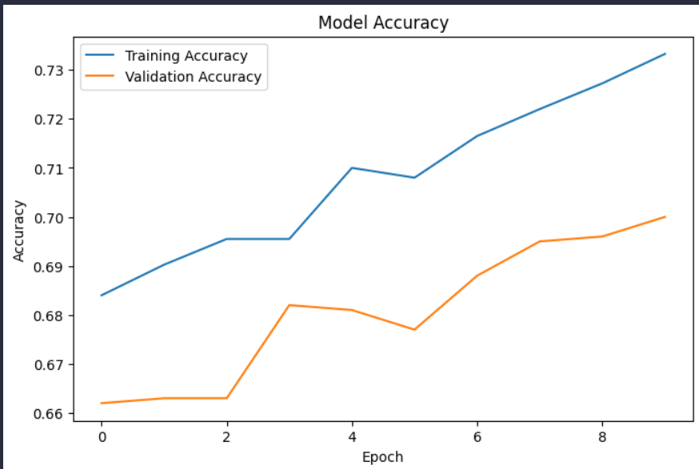
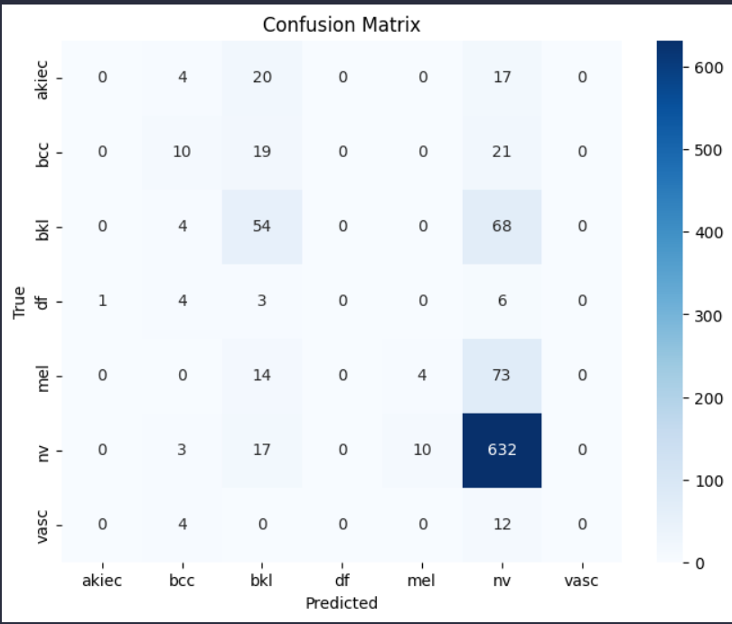
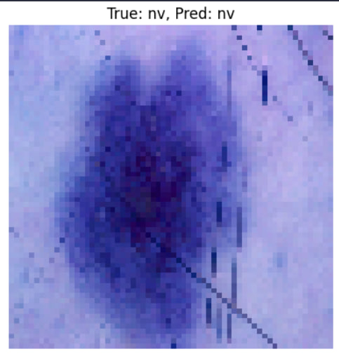

# Skin Cancer Detector

This project uses deep learning to classify skin cancer images using the HAM10000 dataset.

## Dataset

The dataset used is the [Skin Cancer MNIST: HAM10000](https://www.kaggle.com/datasets/kmader/skin-cancer-mnist-ham10000) available on Kaggle.

**Download Instructions:**
1. Visit the Kaggle dataset page: https://www.kaggle.com/datasets/kmader/skin-cancer-mnist-ham10000
2. Click the "Download" button (you need a Kaggle account).
3. Extract the downloaded files and place the contents in the `data/` directory of this project.

> **Note:** The `data/` folder is excluded from version control and will not be uploaded to GitHub. Download the dataset manually.

## Project Structure
- `model/` - Model architecture and saved models
- `notebook/EDA_and_Model_Training.ipynb` - Data exploration and model training notebook
- `requirements.txt` - Python dependencies
- `data/` - Place the HAM10000 dataset files here (not tracked by git)

## Setup
1. Install dependencies:
   ```sh
   pip install -r requirements.txt
   ```
2. Download and extract the dataset as described above.
3. Run the notebook for EDA, training, and evaluation.

## Sample Output
Below are sample output images generated during model training and evaluation.

| Training Accuracy | Confusion Matrix | Example Predictions |
|-------------------|------------------|---------------------|
|  |  |  |

